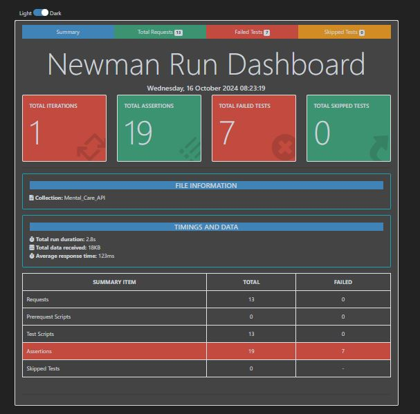

# MentalCare API Testing with Postman and Newman

## Overview
This repository contains the API testing scripts for the **Mental Care System Platform**. The API tests are designed to validate various functionalities of the platform to ensure they are working as expected. The tests are executed using **Postman** and **Newman**.

## Features Tested
The following functionalities of the Mental Care API are tested:

- **Psychologist Registration**: Validates the API for registering new psychologists.
- **User Login (Valid and Invalid Credentials)**: Tests the login process using both valid and invalid credentials.
- **Creating Blog**: Ensures the API allows users to create new blog entries.
- **Deleting Blog**: Tests the ability to delete existing blog posts.
- **Getting All Blogs**: Retrieves all blog posts from the platform.
- **Getting Individual Psychologist Blogs**: Retrieves blog posts created by a specific psychologist.
- **Admin Deleting User Account**: Validates the admin’s ability to delete normal user accounts.
- **Admin Deleting Psychologist Account**: Ensures that the admin can delete psychologist accounts.
- **Admin Approving Psychologist Account**: Verifies the approval process for psychologists by the admin.
  
## Generating Newman Report
All API tests are executed via **Newman**, and the results are saved in a detailed report.

[See the full Newman report](https://github.com/AyeshaNasrinRipa/MentalCare-API-Testing-Postman-Newman/index.html)

## Prerequisites
- Postman
- Newman

## Screenshot
